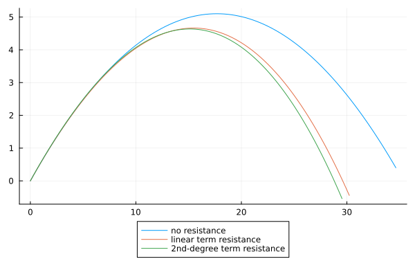
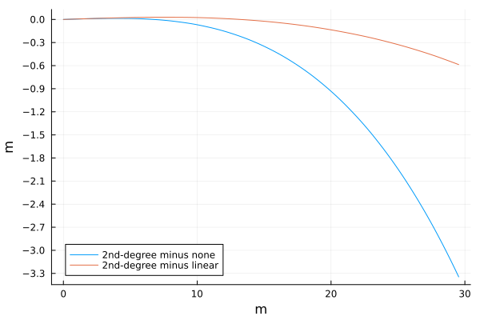
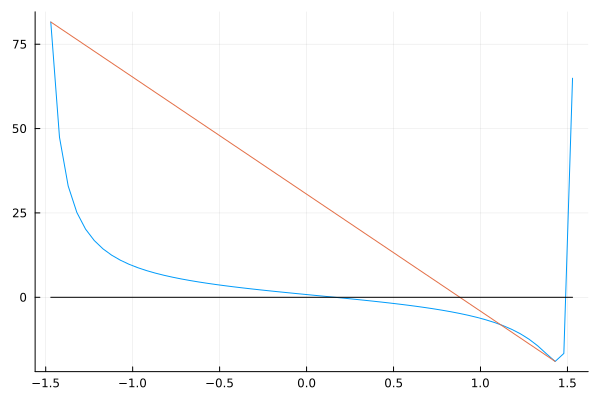

---
tags:
  - 物理
  - 数学
  - julia
datetime: 2025-01-28
---

# 抛体运动弹道解算
## 模型
本文考虑使用 [*线性阻力*](https://zh.wikipedia.org/wiki/阻力#雷諾數很低時的阻力) 模型. 事实上, 在空气中运动的阻力应该由 [*二次阻力*](https://zh.wikipedia.org/wiki/阻力#高速時的阻力) 描述, 关于二者的对比将在[后文](#与二次阻力的对比)给出.

之所以使用线性阻力, 是因为如此一来物体的运动微分方程
$$
m \dot{\mathbf{v}} = -k \mathbf{v} - m g \hat{\mathbf{j}}
$$
有封闭解. 进一步令 $\mu := \frac{k}{m}$, 上式化为
$$
\dot{\mathbf{v}} = -\mu \mathbf{v} - g \hat{\mathbf{j}}
$$
容易解得
$$
\mathbf{v} = \mathrm{e}^{-\mu t} \mathbf{v}_0 - \mu^{-1} (1-\mathrm{e}^{-\mu t}) g \hat{\mathbf{j}}
$$
积分得
$$
\mathbf{r} = \mathbf{r}_0 - \mu^{-1} (1-\mathrm{e}^{-\mu t}) \mathbf{v}_0 - \mu^{-2} (\mu t + \mathrm{e}^{-\mu t} - 1) g \hat{\mathbf{j}}
\tag{1.1}
% \label{movement}
$$
这就是线性阻力情况下的运动方程. 它也可以很轻松地分解为两个方向来运算.

### 与二次阻力的对比
当速度较大 ($\sim 20 \, \mathrm{m/s}$) 时, 弹丸在空气中运动的 [*雷诺数*](https://zh.wikipedia.org/wiki/雷诺数#流体中的球) 很大, 并不适用于线性阻力.
但是在上升过程中, 速度逐渐下降, 雷诺数也逐渐变小, 于是在上升阶段用线性阻力模型的误差也不是很大.

下面的图展示了无阻力, 线性阻力与二次阻力在初速 $20 \, \mathrm{m/s}$, 射角 $60 \degree$ 时的运动轨迹, 可以看到上升阶段两条阻力曲线都十分接近, 随着下降时速度越来越快才逐渐分离.


显然两种阻力的系数量纲不同, 于是其值也必然不同.
找到合适的线性阻力系数就成为逼近真实情况的重点之一.
在流体中的二次阻力可以用 $f = \frac{1}{2} \rho v^2 C_d S$ 计算,
其中 $\rho$ 为流体密度; $C_d$ 为阻力系数, 由实验得出; $S$ 为参考面积.
我们希望由此推出线性阻力的系数, 使二者轨迹相差无几.

我们令 $\kappa = \frac{1}{2} \frac{\rho C_d S}{m}$,
于是二次阻力情况下加速度 $\mathbf{a}_f = -\kappa |\mathbf{v}| \mathbf{v}$;
对比线性阻力情况下 $\mathbf{a}_f = -\mu \mathbf{v}$, 可以看出重点是找到一个合适的 $\mu$, 使得其在 $\mathbf{v}$ 不断变化的时候仍有 $\mu \sim \kappa |\mathbf{v}|$.

一种朴素的想法是使 $\mu$ 等于 $\kappa |\mathbf{v}|$ 的均值.
也就是令
$$
\mu = \kappa \frac{\int_{0}^{t} |\mathbf{v}| \, \mathrm{d} t}{t}
$$
注意到二次阻力模型下运动方程
$$
\begin{align*}
\dot{v}_x &= -\kappa |\mathbf{v}| \, v_x \\
\dot{v}_y &= -\kappa |\mathbf{v}| \, v_y - g
\end{align*}
$$
蕴含一个 $|\mathbf{v}|$. 只考虑 $x$ 方向, 可得
$$
\begin{align*}
\int_{0}^{t} \kappa |\mathbf{v}| \, \mathrm{d} t &= -\int_{0}^{t} \frac{\dot{v}_x}{v_x} \, \mathrm{d} t \\
&= -\int_{v_{0x}}^{v_x} \frac{\mathrm{d} v_x}{v_x} \\
&= \ln{\frac{v_{0x}}{v_x}}
\end{align*}
$$
于是 $\mu = t^{-1} \ln{(v_{0x}/v_x)}$.

可以通过欧拉法取得 $v_x$ 的数值解, 对于给定的 $t$, 可以认为在这段时间内 ( $0 \sim t$ ) 使用 $\mu$ 的线性阻力模型与使用 $\kappa$ 的二次阻力模型取得的轨迹相差无几.

但是应该注意, 随着 $t$ 的增大, $v_x$ 逐渐减小趋近于 $0$, 因此 $t$ 不宜取得太大.
实际应用中, 可以用射角 $45\degree$, 在上升到最高点之前的时间段计算的 $\mu$ 来作为通用结果使用.


上图展示了参数为 $\kappa$ 的二次阻力模型与计算得到的使用 $\mu$ 的线性阻力模型, 以及无阻力模型在 $y$ 方向上的差值. 射角 $60\degree$, 初速 $20 \, \mathrm{m/s}$. 可以看出线性阻力模型在 $x > 15 \, \mathrm{m}$ 时才有显著的偏差.

## 轨迹方程
将 $(1.1)$ 中 $t$ 消去, 即为轨迹方程.

我们先将初速度 $\mathbf{v}_0$ 分解为 $v_0 \, (\cos{\theta}, \sin{\theta})^T$, 而后在 $x$ 方向解出 $t$:
$$
t = \mu^{-1} \ln{\frac{v_0 \cos{\theta}}{v_0 \cos{\theta} - \mu x}}
$$
之后将其代入 $y$ 方向, 化简得
$$
y - \frac{g}{\mu^2 v_0} (\mu x \sec{\theta} - v_0 \ln{\frac{v_0}{v_0 - \mu x \sec{\theta}}}) - x \tan{\theta} = 0
\tag{2.1}
$$
轨迹上的点 $(x, y)^T$ 都应满足于上面的方程, 这便是轨迹方程.

在初速 $v_0$ 确定的情况下, 这是关于 $\theta$ 的一个方程. 想要得到给定轨道上一点 $(x, y)^T$ 的情况下 $\theta$ 的值, 只需解这个方程就好. 可以用诸如 *牛顿法* 等数值方法来获得相当精确的解.

### 确定初值
牛顿法等迭代方法是初值敏感的, 初值的选取决定了迭代的次数与最终精度. 对于有多个根的函数, 初值还决定了最终结果是哪一个根.

显而易见, 对于一般的目标, 抛体运动总有两条可达的轨迹. 一条是在上升时到达, 一条则在下降时. 我们总是更喜欢上升时到达的情况, 因为这样运动的时间短, 且可以使用线性阻力模型更精确地模拟, 误差更小. 这就对初值的选取提出了要求.

令 $(2.1)$ 左边为目标函数 $f(\theta)$, 规定定义域为 $(-\frac{\pi}{2}, \frac{\pi}{2})$ 的子集, 作图观察 (曲线; $\mu = 0.01$, $v = 20 \, \mathrm{m/s}$, $(x, y) = (5, 0.5)$):

显然有两个解. 并且容易想到上升时到达的轨迹, 射角小于下降时到达的, 于是左边一根即为所求射角.

对目标函数求导并令其等于 $0$, 可以得到其极值. 容易证明, 其极值至多一个, 且为最小值. 这里直接给出目标函数的最小值点:
$$
\theta = \arctan{\frac{v_0^2}{g x}} - \arctan{\frac{\mu x}{\sqrt{v_0^2 + x^2 ((g / v_0)^2 - \mu^2)}}}
$$

假如我们将初值选在最小值点的左侧, 那么迭代求出的根就是较小的一根. 进一步我们想到, 相较于 **区间最左端的点** 或 **最小值点左邻域内的点**, 不妨取这两点连线, 即图上斜线与 $x$ 轴的交点, 这样更接近于根. 如此一来还可以避开上述两点附近数值不稳定的区域.

## 排除不可达点
给定的目标点并不总是有可达的抛体轨迹. 若是能在计算前将其排除, 便可避免再在繁杂的计算中消耗时间. 需要注意的是, 排除过程也需耗时, 且对于每个输入数据都需要计算, 因此需要平衡前期排除与正式计算间的平衡, 以优化耗时.

### 射角范围
实际应用中, 射角几乎总是不能达到 $(-\frac{\pi}{2}, \frac{\pi}{2})$, 于是若目标点与原点的夹角大于射角的最大值, 那么显然不能到达.

尤其注意, 当夹角小于射角最小值时, 仍然有可能到达, 因为物体在重力作用下会下坠.

### 包络线
另外, 若是无阻力模型都到达不了的点, 那么线性乃至于二次阻力模型也一定不可达. 因此可以使用抛物线的包络线来检查, 若是在包络线以外 (以上) 的点, 一定是不可达点.

对于无阻力的抛体运动, 可以直接写出其运动方程
$$
\begin{align*}
x &= v_0 t \cos{\theta} \\
y &= v_0 t \sin{\theta} - \frac{1}{2} g t^2
\end{align*}
$$
两式联立消去 $t$, 得到
$$
\begin{align*}
y &= v_0 \sin{\theta} \, \frac{x}{v_0 \cos{\theta}} - \frac{1}{2} g (\frac{x}{v_0 \cos{\theta}})^2 \\
  &= x \tan{\theta} - \frac{g x^2}{2 v_0^2} \sec^2{\theta} \\
  &= x \tan{\theta} - \frac{g x^2}{2 v_0^2} (1 + \tan^2{\theta})
\end{align*}
$$
以 $\theta$ 为未知数, 若是其恰有一解, 则上述轨迹方程处于临界状态; 若目标点再稍抬高则不可达. 注意到上述方程为关于 $\tan{\theta}$ 的二次方程, 且 $\tan{x}$ 在 $(-\frac{\pi}{2}, \frac{\pi}{2})$ 内为双射, 于是令
$$
\begin{align*}
\Delta &= x^2 - 4 \frac{g x^2}{2 v_0^2} (\frac{g x^2}{2 v_0^2} + y) \\
       &= 0
\end{align*}
$$
即
$$
y = -\frac{g}{2 v_0^2} x^2 + \frac{v_0^2}{2 g}
$$
这便是抛体运动的包络线方程. 若点 $(x, y)$ 在方程之上, 则不可到达.

### 其他
在实际计算中对于根号与分式要特别注意, 防止出现超出定义域的情况. 可以在计算前简要判断一下, 确保各函数的自变量都在其定义域内.

## 代码实现
[代码由 `julia` 编写](ballistic.jl). Benchmark 显示其性能十分卓越:
```
#@benchmark θ([5.,0.5], 20., 9.8, 0.1, (-pi/6,pi/3))
BenchmarkTools.Trial: 10000 samples with 223 evaluations per sample.
 Range (min … max):  331.390 ns …  19.150 μs  ┊ GC (min … max): 0.00% … 97.41%
 Time  (median):     335.426 ns               ┊ GC (median):    0.00%
 Time  (mean ± σ):   363.941 ns ± 333.661 ns  ┊ GC (mean ± σ):  1.97% ±  2.52%

 Memory estimate: 80 bytes, allocs estimate: 2.
```
可以看到计算一次的时间仅为 $335.426 \, \mathrm{ns}$ (中位数), 占用 $80$ 字节空间.